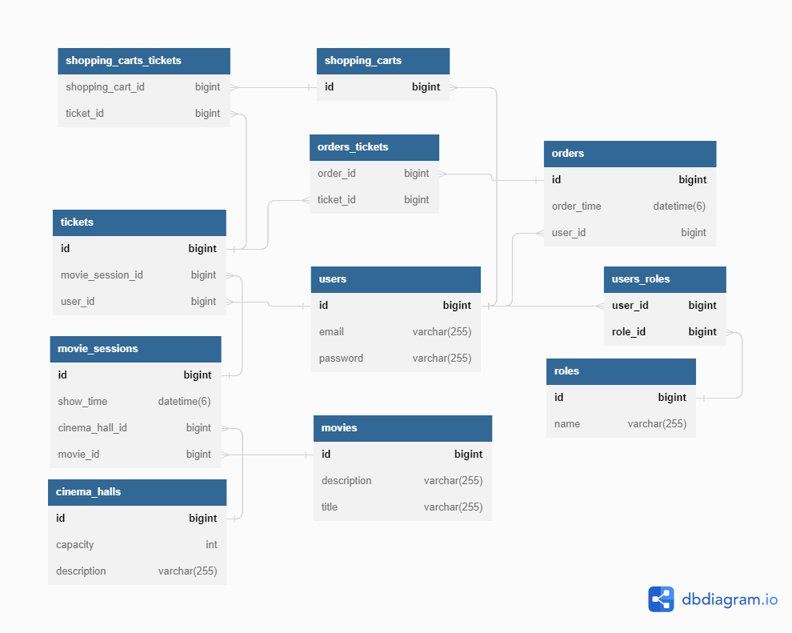

# 🎥Cinema app🎥
## <h>Short description☕</h>
This Java web project is built with SOLID and OOP principles in mind.
Unique functionality is also provided for both user and admin roles.
The application supports all CRUD operations
These design choices ensure the project is flexible and maintainable.

## <h>Features for User👤</h>
* Registration: Users can register for an account on the platform.
* Get all cinema halls: Users can view a list of all the cinema halls available on the platform.
* Get all movies: Users can view a list of all the movies available on the platform.
* Get all movie sessions: Users can view a list of all the movie sessions available on the platform.
* Get my orders: Users can view a list of all the orders they have placed on the platform.
* Complete my orders: Users can complete their orders by paying for the tickets.
* Add movie session to shopping cart: Users can add a movie session to their shopping cart for purchase.
* Get my shopping carts: Users can view their shopping cart and the items they have added to it.

## <h>Additional features for Admin👷</h>
* Add cinema halls: Admins can add new cinema halls to the platform.
* Add movies: Admins can add new movies to the platform.
* Add, Update, Delete movie sessions: Admins can add, update, and delete movie sessions on the platform.
* Get all users: Admins can view a list of all the users registered on the platform.

## <h>Project structure🧠</h>
* <em><b>src/main/java</b></em> - Contains the Java source code for the project,
  organized according to a layered architecture.
   <em><b>&nbsp;&nbsp;&nbsp;&nbsp;controller</em></b> - Contains the controllers that handle incoming HTTP requests
  and delegate to the appropriate service layer.
   <em><b>&nbsp;&nbsp;&nbsp;&nbsp;dao</em></b> - Contains the data access objects that handle interactions with the database.
   <em><b>&nbsp;&nbsp;&nbsp;&nbsp;model</em></b> - Contains the domain model objects representing the entities in the system.
   <em><b>&nbsp;&nbsp;&nbsp;&nbsp;service</em></b> - Contains the business logic and serves as an intermediary between the controller and dao layers.
* <em><b>src/main/resources</em></b> - Contains the application configuration files.
* <em><b>pom.xml</em></b> - The Maven project configuration file.

## <h>Technologies🛠</h>
<ul>
  <li><a href="https://www.oracle.com/java/technologies/javase/jdk17-archive-downloads.html" target="_blank">JDK 17</a></li>
  <li><a href="https://maven.apache.org/download.cgi" target="_blank">Maven 3.1.1</a></li>
  <li><a href="https://dev.mysql.com/downloads/mysql/" target="_blank">MySQL 8.0.22</a></li>
  <li><a href="https://tomcat.apache.org/download-90.cgi" target="_blank">TomCat 9.0.50</a></li>
  <li>Spring security 5.6.10</li>
  <li>Spring Web 5.6.10</li>
  <li><a href="https://spring.io/" target="_blank">Spring 5.3.20</a></li>
  <li>Hibernate 5.6.14.Final</li>
</ul>

## <h>How to start the program👌</h>
1️⃣Ensure that you have
<a href="https://www.oracle.com/java/technologies/javase/jdk17-archive-downloads.html" target="_blank">JDK 17</a>
, Maven, and <a href="https://dev.mysql.com/downloads/mysql/" target="_blank">MySQL 8.0.22</a>
installed on your system.\
2️⃣Clone the project from GitHub\
3️⃣Update the database configuration in <a href="https://github.com/Bodddd/cinema-app/blob/main/src/main/resources/db.properties" target="_blank"><em><b>db.properties</em></b></a> with your own MySQL credentials.\
4️⃣Run the Maven command mvn clean package to make sure everything is fine.\
5️⃣Configure <i>TomCat</i> for this project\
6️⃣Access the application at http://localhost:8080 in your web browser.\
7️⃣You can use password and login from <a href="https://github.com/Bodddd/cinema-app/blob/main/src/main/java/cinema/config/DataInitializer.java" target="_blank">DataInitializer</a>

## <h>UML Database Diagrams🚀</h>

